# kparser2
Generate a diagram describing the following ETL workflow for a MMORPG parser. 

## Game client.
Final Fantasy is a MMORPG with the Ashita addon system.
The addon will be written in Lua.
I have an addon called `kpacket` that will publish game packets over ZMQ.

## Desktop client
The desktop client will be written in F#
The desktop client `kparser2` will subscribe to those game packets over ZMQ
The desktop will extract the packets by parsing them into F# types.
The desktop will provide a plugin system for the transform and load feature. This will allow user to write scripts to transform the game logic from packets to a database, then that database can be queried to load analytics to a UI pane that can be loaded in tabs or cards to display the output of many plugins at one time.

## diagram

```mermaid
graph LR
    subgraph Game_Client
        A1[Game Client: Final Fantasy MMORPG]
        A2[Addon System: Ashita]
        A3[Addon: kpacket]
        A1 --> A2
        A2 --> A3
        A3 --Publish Packets--> B1
    end

    subgraph Desktop_Client
        B1[Subscribes to Packets: ZMQ]
        B2[Desktop Client: kparser2]
        B3[Parser: Parse packets into F# types]
        B4[Plugin System: Transform and Load]
        B5[Database: Store Transformed Data]
        B6[UI Pane: Query and Display Analytics]

        B1 --> B2
        B2 --> B3
        B3 --> B4
        B4 --> B5
        B5 --> B6
    end
```

## notes
The game and desktop client will typically be on the same computer. Alternatively, a user is playing on a Steam Deck and could parse from their laptop.
